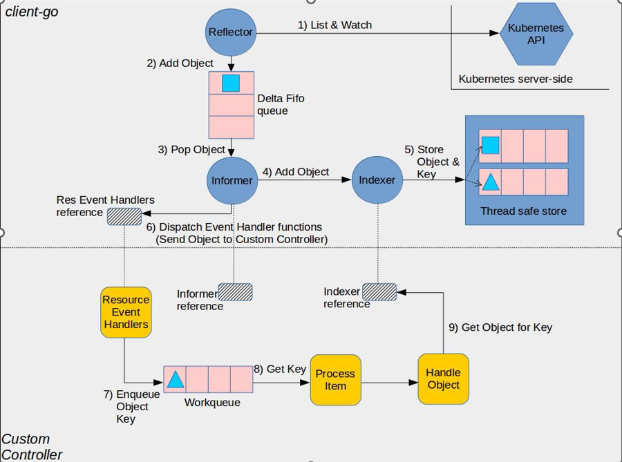

# Nginx Controller

一个监控nginx数量的controller

## Usage
启动controller
```shell
$ go build .
$ ./nginx-controller -kubeconfig /root/.kube/config -alsologtostderr true
```

apply crd
```shell
kubectl apply -f ./artifacts/example/crd.yaml
```

apply cr
```shell
kubectl apply -f ./artifacts/example/example-nginx.yaml
```

## Test
当cr中定义的副本数为2时，会自动启动2个nginx的pod
```shell
$ vim example-nginx.yaml 
$ kubectl apply -f example-nginx.yaml 
$ cat example-nginx.yaml 
apiVersion: demo.mark8s.io/v1alpha1
kind: Nginx
metadata:
  name: my-nginx
spec:
  replicas: 2
$ kubectl get po
NAME                            READY   STATUS    RESTARTS   AGE
nginx-pod-1654078536671008205   1/1     Running   0          14m
nginx-pod-1654079421678202242   1/1     Running   0          9s
```

当cr中定义的副本数为5时，会自动启动5个nginx的pod.效果类似 replicaSet
```shell
$ vim example-nginx.yaml 
$ kubectl apply -f example-nginx.yaml 
$ cat example-nginx.yaml 
apiVersion: demo.mark8s.io/v1alpha1
kind: Nginx
metadata:
  name: my-nginx
spec:
  replicas: 5
$ kubectl get po
NAME                            READY   STATUS    RESTARTS   AGE
nginx-pod-1654078536671008205   1/1     Running   0          17m
nginx-pod-1654079421678202242   1/1     Running   0          2m43s
nginx-pod-1654079527716529235   1/1     Running   0          57s
nginx-pod-1654079527722074237   1/1     Running   0          57s
nginx-pod-1654079527724902515   1/1     Running   0          57s
```

## 原理


1.informer：生成的代码，监听apiserver中特定资源变化，然后会存储到一个线程安全的local cache中，最后回调我们自己实现的event handler。
 
2.local cache：生成的代码，informer实时同步apiserver（也就是etcd）中的数据到内存中存储，可以有效降低apiserver的查询压力，但缺点就是实时性不好，本地会比远 程的数据落后一点点但会最终与etcd一致，所以需要根据情况具体分析是走Local cache还是apiserver实时获取数据。

3.lister：生成的代码，提供了CURD操作访问local cache。

4.controller：一个逻辑概念，就是指调度某种资源的实现而已，需要我们自己开发。Controller做的事情主要包括：  
   
   a)	实现event handler处理资源的CURD操作 

   b)	在event handler，可以使用workqueue类库实现相同资源对象的连续event的去重，以及event处理异常后的失败重试

5.Workqueue：一个单独的类库，是可选使用的，但通常都会使用，原因上面说了。我们需要在实现event handler的时候把发生变化的资源标识放入 ，供下面的processor消费。

6.Clientset：默认clientset只能CRUD k8s提供的资源类型，比如deployments，daemonset等；生成的代码为我们自定义的资源（CRD）生成了单独的clientset，从而让我们使用结构化的代码CURD自定义资源。也就是说，想操作内建资源就用k8s自带的clientset，想操作CRD就用生成代码里的clientset。

7.Processor：我们实现的go协程，消费workqueue中的事件，workqueue提供了按资源标识的去重。


## Reference

[sample-controller](https://github.com/kubernetes/sample-controller)

[owenliang/k8s-client-go](https://github.com/owenliang/k8s-client-go/tree/master/demo10)

